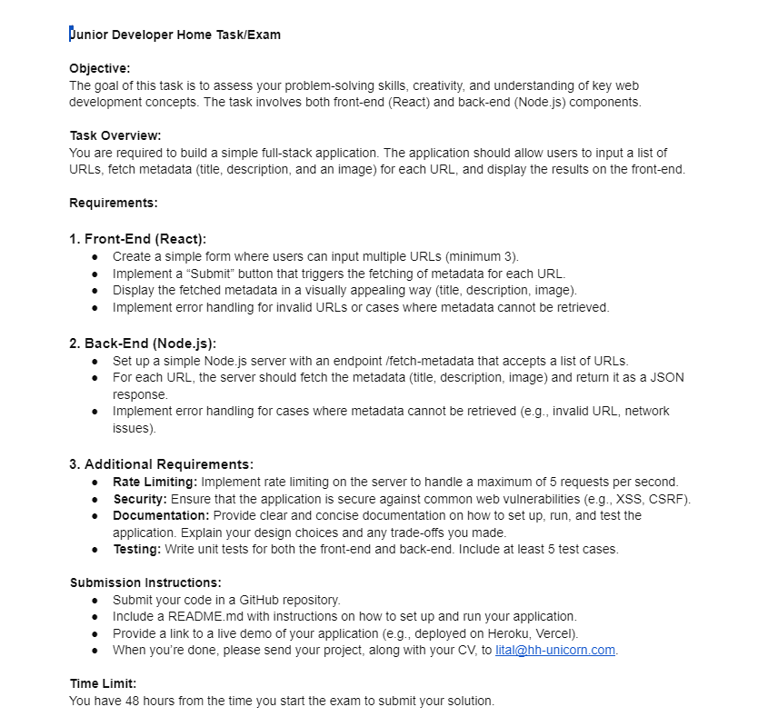

# Tolstoy Exam - Meta Data Fetcher

### Instructions



---

### Preview

#### Gif


<br>
<br>

#### Youtube Video

[](https://www.youtube.com/watch?v=uedWgeJFZw0)

---

#### Link To The Site

- Frontend : https://hasan-tolstoy-exam.netlify.app/
- Backend : https://exam-fvai.onrender.com/

Things to know:

- Im using free Render tier to host my server so the scraping might not work as intended because it takes long time to scrape the data which leads to navigation timeout error.
- I fixed it by changing the rateLimiter middleware to 100 requests per minute, and I also changed the navigation timeout to 2 minutes because i noticed it takes 1 to 2 minutes to scrape.
- Scraping locally will scrape pretty quickly.
- The Design of the UI was very simple, I didnt put much effort on it.
- I did not test the frontend because I never tried to learn how to even though I'm a fast learner :).
- I had many difficulties with running puppeteer on Render because it requires chromium to run, but after some research I learned that i have to use Docker to make it work.
- I also had many difficulties with fetching the data using Render because it kept giving me navigation timeout and sometimes I didn't get the correct response because of the sites bot detection, but I fixed it by installing puppeteer extra and puppeteer-extra-plugin-stealth to avoid the bots.

###### - If the scraping takes more than 2 minutes then its probably the server is sleeping , give it some time ^

---

# Instructions for setting up the project

## Client

You have to create .env file and configure it with the following environment variable:

```
VITE_BACKEND_URL = [The link to your server]
```

To run the client you have to open the terminal and type:

```
cd client
npm install
npm run dev
```

---

## Server

You have to create .env file and configure it with the following environment variable:

```
NODE_ENV = [locally = dev / On Render = production ]
PORT = [Your port number]
CLIENT_LINK = [The link to your frontend]
```

---

**_ To deploy the server on render you have to add these docker environment variables for puppeteer to work _**

```
PUPPETEER_SKIP_CHROMIUM_DOWNLOAD = true
PUPPETEER_EXECUTABLE_PATH = /usr/bin/google-chrome-stable
```

---

To run the server you have to open the terminal and type:

```
cd server
npm install
npm run dev
```

To run the tests you have to open the terminal and type:

```
cd server (if you are not in the server folder)
npm test
```

---

## Used technologies

#### Frontend

- Vite
- React
- Typescript

#### Backend

- NodeJS
- ExpressJS
- Express-rate-limit
- Cors
- Dotenv
- Puppeteer
- Puppeteer-extra
- Puppeteer-extra-plugin-stealth
- Mocha
- Chai
- Supertest
- Helmet

---

#### Route example for testing

```
[server Link]/fetch-metadata?urls=https://www.facebook.com/&urls=https://www.google.com/&urls=https://www.gotolstoy.com/&urls=https://www.tesla.com/
```
